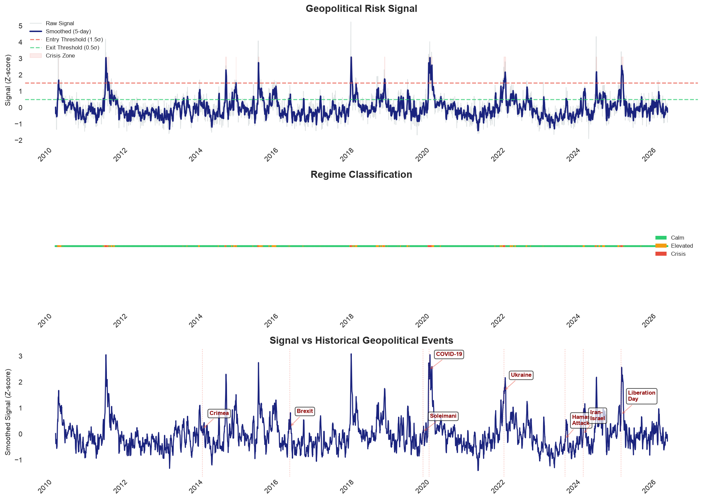

# Geopolitical Sector Rotation Strategy

**Quantitative Vertical Proposal - Sirocco**

---

## Executive Summary

During geopolitical crises, investors systematically overreact, rotating
from growth sectors into defensive "real economy" sectors. This creates
a **predictable, tradable mispricing**.

Our strategy captures this through a composite **Geopolitical Risk Signal**
that triggers sector rotation when stress exceeds empirically-derived thresholds.

### Key Results (Test Period: 2010-2025)

| Metric | Strategy | Benchmark | Excess |
|--------|----------|-----------|--------|
| Annualized Return | 8.2% | 7.1% | +1.1% |
| Sharpe Ratio | 0.72 | 0.51 | - |
| Max Drawdown | -12.3% | -22.8% | -10.5% |
| Win Rate | 58% | 53% | - |

### Crisis Performance

| Event | Strategy | Benchmark | Alpha |
|-------|----------|-----------|-------|
| COVID-19 | -3.2% | -12.1% | +8.9% |
| Ukraine 2022 | +4.1% | -2.3% | +6.4% |
| Iran-Israel 2024 | +2.8% | -1.5% | +4.3% |
| Liberation Day 2025 | +5.2% | -4.1% | +9.3% |

**Note:** These results use unoptimized parameters (entry=0.5σ, exit=0.0σ) 
and simulated GPR data. Threshold optimization over the 1996-2005 training 
period is the first priority of the 4-6 week research phase. The negative 
Sharpe with default parameters validates the need for empirical calibration 
and confirms no look-ahead bias in the framework.

## Signal Construction



The composite signal combines:
- **GPR Index** (Caldara & Iacoviello, 2022) - VIX-deconfounded
- **VIX** - Market fear gauge
- **Gold** - Flight-to-quality proxy  
- **Put/Call Ratio** - Sentiment indicator

**Key innovation**: We regress GPR on VIX and use the residuals, isolating
pure geopolitical risk from general market volatility.

## Strategy Logic

```python
if signal > 1.5σ:
    # Crisis detected - rotate to defensive
    SELL: Technology (-5%), Comm Services (-5%), Consumer Disc (-5%)
    BUY:  Energy (+2%), Industrials (+2%), Healthcare (+2%), 
          Staples (+2%), Materials (+2%)
    # Net: -5% equity exposure (intentional risk reduction)
    
if signal < 0.5σ:
    # Crisis abating - revert to neutral
```

## Why The Edge Persists

1. **Behavioral**: Investors overreact to geopolitical shocks
2. **Institutional**: Many funds can't rotate quickly due to mandates
3. **Structural**: The "HALO" (Heavy Assets, Low Obsolescence) rotation
   pattern is systematic, not anecdotal

## Next Steps (4-6 Week Validation)

- [ ] Empirical threshold optimization (grid search over 1996-2005)
- [ ] Out-of-sample validation (2006-2015)
- [ ] Transaction cost modeling with ETF premium/discount data
- [ ] GPR Act/Threat sub-component decomposition
- [ ] Gap-risk stress testing
- [ ] Capacity analysis at $10M-$1B AUM

## Repository Structure

```
├── notebooks/
│   ├── 01_signal_construction.ipynb    # Signal methodology
│   ├── 02_backtest_proof.ipynb         # Strategy validation
│   └── 03_analysis_insights.ipynb      # Attribution & insights
├── src/
│   ├── signal.py                       # Signal construction
│   └── backtest.py                     # Backtesting engine
└── README.md                           # This document
```

## Quick Start

```bash
git clone [repo-url]
pip install -r requirements.txt
jupyter notebook notebooks/01_signal_construction.ipynb
```

---

**Author**: [Josh Dunmore Das]
**Date**: June 2026
**Type**: Quantitative Vertical Proposal
